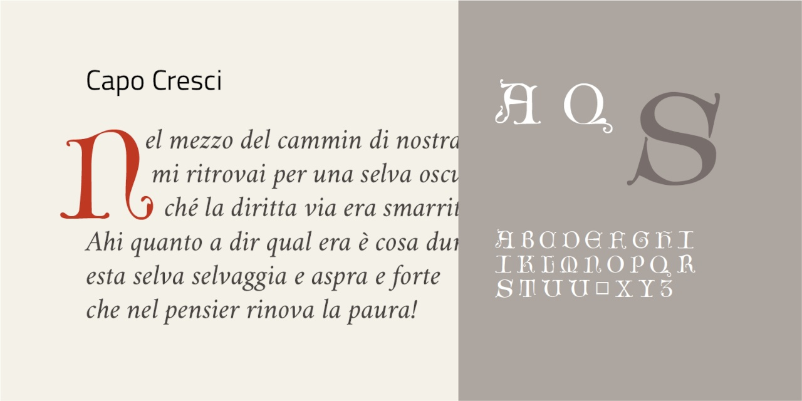

# Capo Cresci
- Versione 1.0: versione iniziale.

Per testare il font, vedere la [pagina interattiva](https://m-casanova.github.io/CapoCresci/).

## Descrizione

Il font **Capo Cresci** è basato su scansioni di disegni di capolettera di Giovanni Francesco Cresci  nell'opera _[Il perfetto scrittore](https://bibliotheque-numerique.inha.fr/viewer/52731/?offset=#page=80&viewer=picture&o=bookmark&n=0&q=)_ (1570).

Manca la lettera _W_; è presente una variante per la lettera _T_, accessibile tramite caratteristica '**ss01**'.
